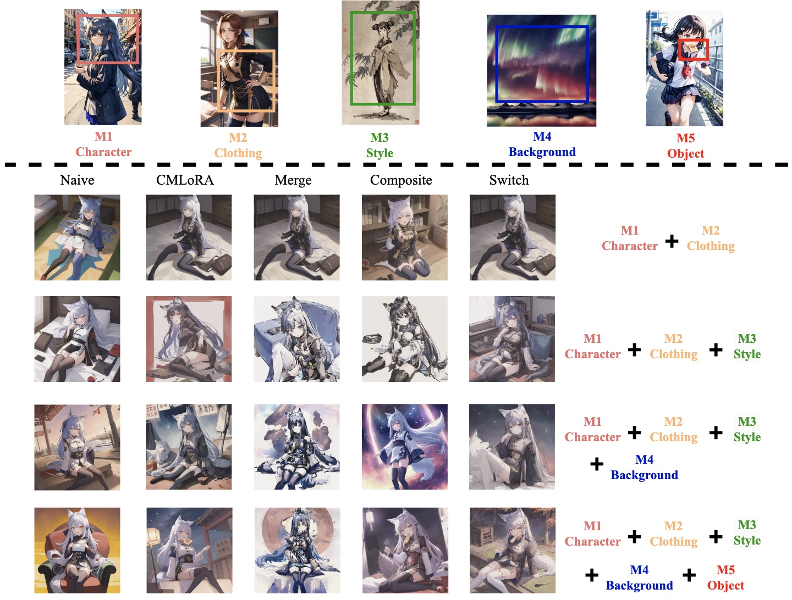

# Cached Multi-Lora Composition for Multi-Concept Image Generation
<p align="center">
  <a href="https://github.com/Yqcca/CMLoRA"></a>
  <a href="https://openreview.net/forum?id=4iFSBgxvIO&referrer=%5BAuthor%20Console%5D(%2Fgroup%3Fid%3DICLR.cc%2F2025%2FConference%2FAuthors%23your-submissions)"></a>
</p>

## 📜 Description
Low-Rank Adaptation (LoRA) has emerged as a widely adopted technique in text-to-image models, enabling precise rendering of multiple distinct elements, such as characters and styles, in multi-concept image generation. However, current approaches face significant challenges when composing these LoRAs for multi-concept image generation, particularly as the number of LoRAs increases, resulting in diminished generated image quality.  

We devise a frequency domain based sequencing strategy to determine the optimal order in which LoRAs should be integrated during inference. This strategy offers a methodical and generalizable solution compared to the naive integration commonly found in existing LoRA fusion techniques. To fully leverage our proposed LoRA order sequence determination method in multi-LoRA composition tasks, we introduce a novel, training-free framework, Cached Multi-LoRA (CMLoRA), designed to efficiently integrate multiple LoRAs while maintaining cohesive image generation. With its flexible backbone for multi-LoRA fusion and a non-uniform caching strategy tailored to individual LoRAs, CMLoRA has the potential to reduce semantic conflicts in LoRA composition and improve computational efficiency.

The figures below illustrate differences between the traditional LoRA composition approaches and our proposed CMLoRA method:

#### Example 1. Generated images with different $N$ LoRA candidates ($L1$ Character, $L2$ Clothing, $L3$ Style, $L4$ Background and $L5$ Object) across our proposed framework and baseline methods.
<p align="center">
    
</p>

#### Example 2. Generated images with different $N$ LoRA candidates ($M1$ Character, $M2$ Clothing, $M3$ Style, $M4$ Background and $M5$ Object) across our proposed framework and baseline methods.
<p align="center">
    
</p>

#### Example 3. Generated images with different $N$ LoRA candidates ($R1$ Character, $R2$ Clothing, $R3$ Style, $R4$ Background and $R5$ Object) across our proposed framework and baseline methods.
<p align="center">
    
</p>

## 🚀 Getting Started
### Setting Up the Environment
To begin, set up your environment with the necessary packages:
```bash
conda create --name cmlora python=3.10
conda activate cmlora
pip install -r requirements.txt # Inference
pip install -r requirements1.txt # Evaluation
```

### Downloading Pre-trained LoRAs
**ComposLoRA** testbed proposed by [Multi-LoRA-Composition](https://github.com/maszhongming/Multi-LoRA-Composition) collects 22 pre-trained LoRAs, spanning characters, clothing, styles, backgrounds, and objects. Download `ComposLoRA.zip` from [this link](https://drive.google.com/file/d/1SuwRgV1LtEud8dfjftnw-zxBMgzSCwIT/view?usp=sharing), put it in the [models](./models) folder, and unzip it.

## 🖼️ Image Generation with Multi-LoRA Composition
Refer to `example.py` for the full code, and adjust the following command to see results from different composition methods with different LoRA caching strategies:

```bash
python example.py --method composite
```

## 🌟 Multi-LoRA Composition Pipelines
We provide five multi-LoRA composition pipelines: 
### 1. `compose_no_lora`
The method that performs diffusion using prompt-only generation without incorporating any LoRAs.

### 2. `compose_offline`
A multi-LoRA composition method that utilizes an offline LoRA disparity method. This method partitions LoRAs based on the profiled frequency domain based sequencing strategy.

### 3. `compose_online`
This method uses an online frequency partition strategy. LoRAs are dynamically partitioned based on the amplitude of high frequency components during the generative process.

### 4. `compose_async`
This composition pipeline leverages asynchrony in two components: the LoRA switch mechanism and the decaying dominant weight scale $w_{\text{dom}}$.

### 5. `compose_research`
A advanced pipeline for research purposes, this pipeline includes functions to plot the intensity of the high-frequency components and measure the similarity of latent feature maps during the denoising process.

### Additional Resources
- We provide the `fft_analysis.ipynb` notebook for analyzing the amplitude of the frequency spectrum for different images. This tool can help visualize and examine how the frequency components vary across different generated images.
- We implement a revised LoRA Switch method with profiled LoRA partition in `callbacks_sa.py`, while the standard version is available in `callbacks_origin.py`.

## Acknowledgments
* This code is built on the [Diffusers](https://github.com/huggingface/diffusers) and [Multi-LoRA Composition](https://github.com/maszhongming/Multi-LoRA-Composition). The authors would like to thank the open-source community for sharing the models, codebases, and training datasets. 

## Citation
If you find this work useful, please kindly cite our paper:
```bibtex
@article{zou2025cached,
  title={Cached Multi-Lora Composition for Multi-Concept Image Generation},
  author={Zou, Xiandong and Shen, Mingzhu and Bouganis, Christos-Savvas and Zhao, Yiren},
  journal={arXiv preprint arXiv:2502.04923},
  year={2025}
}
```

## License
This project is licensed under the MIT License - see the LICENSE file for details.
